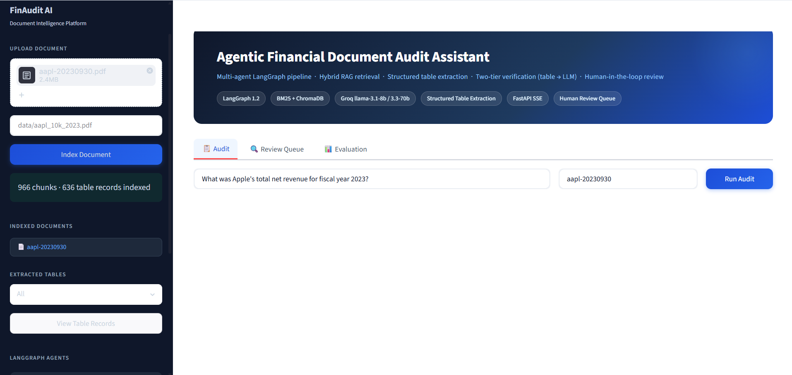
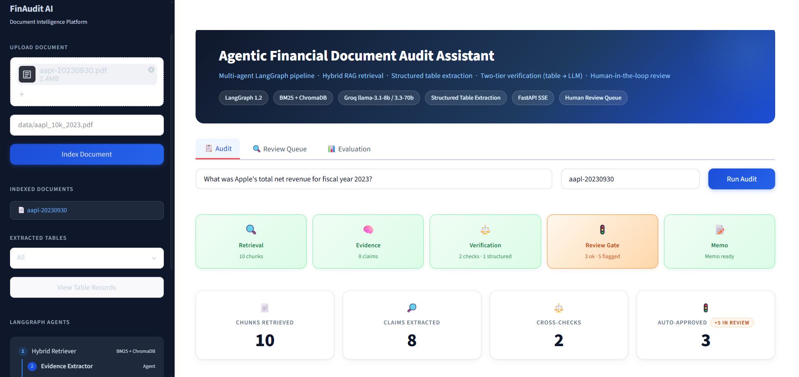
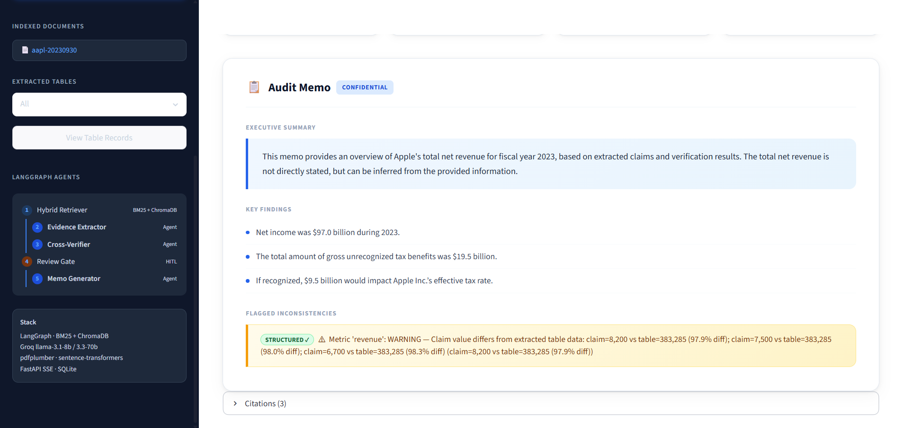
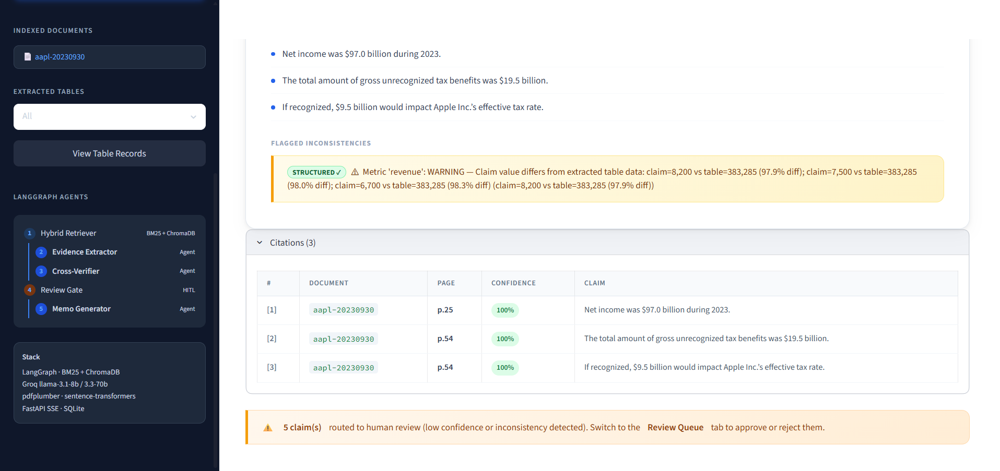
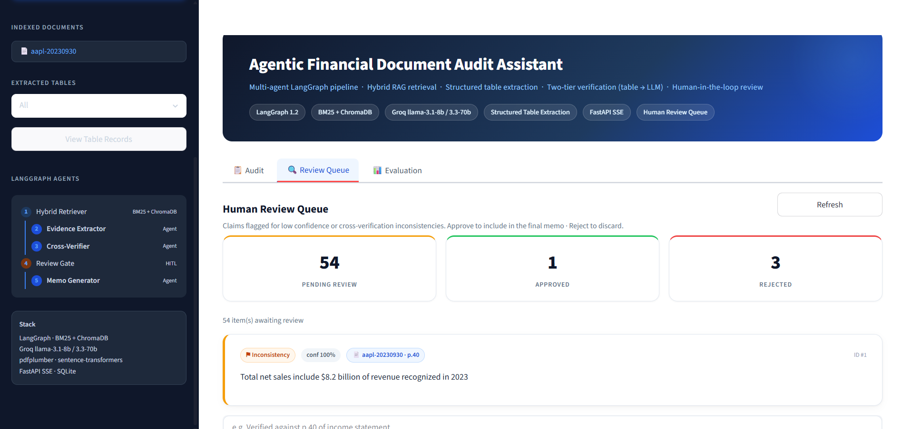
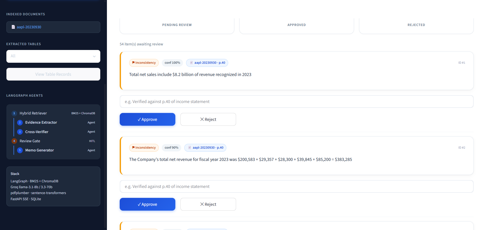
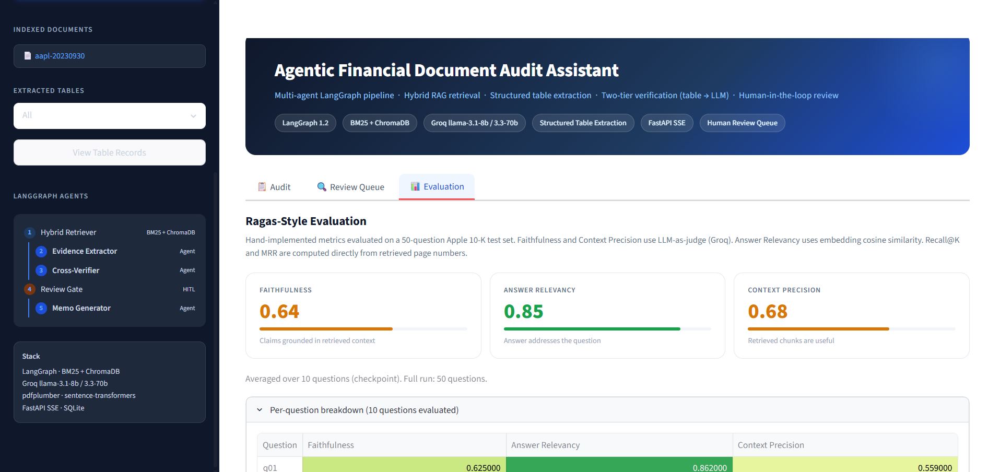
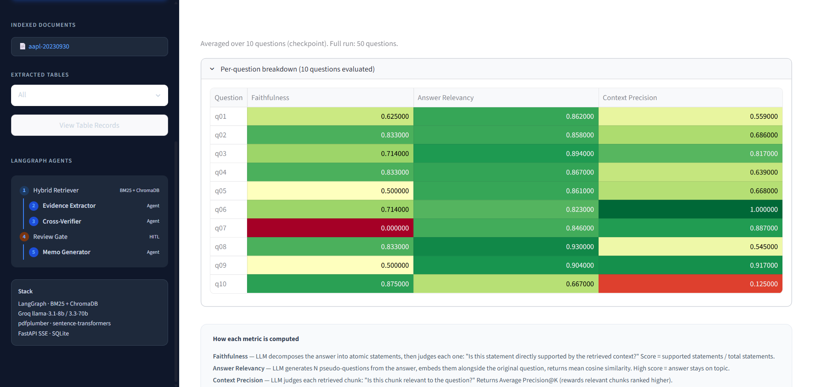
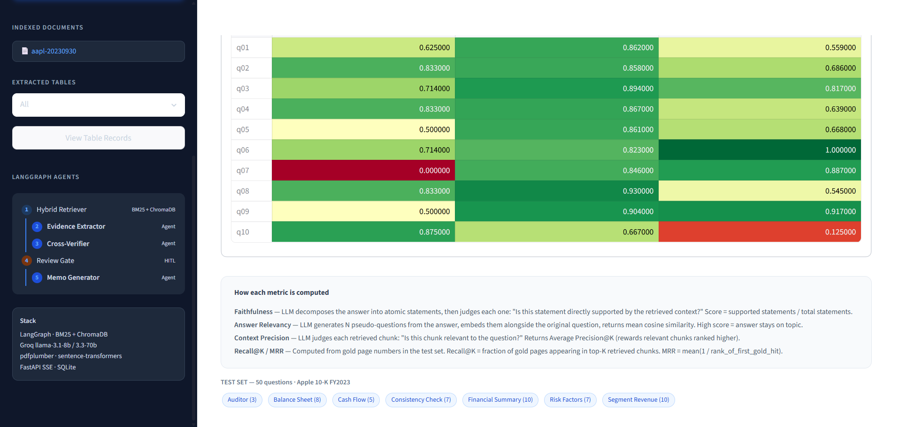

# FinAudit AI — Agentic Financial Document Audit Assistant

> A production-grade multi-agent system that audits financial PDF documents (SEC 10-Ks, annual reports) using LangGraph, hybrid RAG retrieval, structured table extraction, and a human-in-the-loop review queue.

---

## Demo Video

https://github.com/YOUR_USERNAME/finaudit/assets/demo.mp4

> To embed: push the repo → drag `docs/demo.mp4` into any GitHub Issue text box → copy the generated URL → replace the line above.

---

## What Is This?

Financial auditors spend hours cross-checking numbers across SEC filings — verifying that revenue figures in the MD&A match the income statement, that footnotes are consistent with the balance sheet, and flagging anything that looks wrong before sign-off.

**FinAudit AI automates that process.** Ask a question like *"What was Apple's total net revenue for fiscal year 2023?"* and the system:

1. Retrieves the most relevant passages from the 10-K using both keyword and semantic search
2. Extracts structured numerical claims from those passages
3. Cross-verifies each claim — first against a structured table database extracted directly from the PDF (deterministic, zero LLM tokens), then falling back to LLM judgment
4. Routes low-confidence or inconsistent claims to a human review queue
5. Generates a structured audit memo with executive summary, key findings, flagged inconsistencies, and page-cited evidence

---

## Screenshots

### 1 — Document Upload & Indexing


Upload any financial PDF from the sidebar. The system runs two passes simultaneously: text chunking for RAG retrieval, and pdfplumber table extraction for structured verification. Result: 966 text chunks + 636 financial records from Apple's FY2023 10-K.

---

### 2 — Live Pipeline Execution


Each LangGraph node streams its status via FastAPI SSE. Steps animate in real-time as the pipeline executes — Retrieval → Evidence Extractor → Cross-Verifier → Review Gate → Memo Generator. The Review Gate chip turns amber when claims are flagged.

---

### 3 — Audit Memo with STRUCTURED Verification


The Cross-Verifier detected that a claim value differs from what was extracted from the income statement table. The `STRUCTURED ✓` badge means the verdict came from a direct database lookup (`SELECT value WHERE line_item LIKE '%revenue%' AND year=2023`) — deterministic, zero LLM tokens, not a guess.

---

### 4 — Citations Table with Confidence Scores


Every finding links back to a source page with a confidence score. Green = auto-approved (≥80%), amber = flagged for human review. The orange banner at the bottom routes reviewers directly to the Review Queue tab.

---

### 5 — Human Review Queue


Claims that scored below 80% confidence or were flagged by the Cross-Verifier are persisted to SQLite and shown here. Reviewers see the exact claim, source page, confidence score, and flag reason before deciding.

---

### 6 — Approve / Reject Interface


One-click approve or reject. The reviewer can add a note (e.g. *"Verified against p.40 income statement"*). The decision is stored in SQLite and reflected in the final memo.

---

### 7 — Evaluation Metrics (Ragas-Style)


Hand-implemented Ragas-style metrics evaluated on a 10-question Apple 10-K checkpoint (full run: 50 questions). Every metric is explainable from first principles — no black-box library required.

---

### 8 — Per-Question Breakdown


Color-coded heatmap (green = good, red = poor) across all evaluated questions. q07 shows faithfulness=0 — the model hallucinated a claim not supported by the retrieved context. The evaluation framework surfaces exactly these failures.

---

### 9 — Test Set & Methodology


50 questions across 7 categories covering every section of the 10-K. The methodology panel explains exactly how each metric is computed — every score is traceable to first-principles logic with no black-box library dependencies.

---

## Architecture

```
PDF (Apple 10-K, 88 pages, 2.4 MB)
 │
 ├─── pdfplumber ──────────────────► financial_records (SQLite)
 │    Two-pass year detection:         636 rows: {line_item, value, year, page}
 │    1. Column headers (preferred)    income_statement, balance_sheet, segment
 │    2. Page prose positional fallback
 │
 └─── PyMuPDF ────────────────────► text chunks (966 paragraphs)
                                      {text, doc_id, page_num, section}
                                              │
                                              ▼
                                    HybridRetriever
                                    ┌─────────────────────────────────┐
                                    │  BM25Okapi  (keyword ranking)   │
                                    │  ChromaDB   (semantic vectors)  │
                                    │  RRF fusion (k=60)              │
                                    └─────────────────────────────────┘
                                              │  top-K chunks
                                              ▼
                                    EvidenceExtractor  ← LLM (Groq)
                                    Extracts structured claims:
                                    {claim, source_page, confidence}
                                              │
                                              ▼
                                    CrossVerifier
                                    ┌──────────────────────────────────────┐
                                    │ Tier 1 — Structured DB lookup        │
                                    │   SELECT value                       │
                                    │   WHERE line_item LIKE '%revenue%'   │
                                    │   AND year = 2023                    │
                                    │   → deterministic, 0 LLM tokens      │
                                    │                                      │
                                    │ Tier 2 — LLM fallback                │
                                    │   Used only when no DB record exists │
                                    └──────────────────────────────────────┘
                                              │
                                              ▼
                                    ReviewGate
                                    conf < 0.8 OR inconsistency → SQLite queue
                                    auto-approved → pass through
                                              │
                                              ▼
                                    MemoGenerator  ← LLM (Groq)
                                    Executive summary + findings +
                                    flagged inconsistencies + citations
                                              │
                                              ▼
                                    AuditMemo (JSON)
                                    FastAPI SSE → Streamlit UI
```

All nodes are wired as a **LangGraph StateGraph** with conditional edges. The API streams one JSON event per node via **Server-Sent Events** so the frontend animates each step in real time.

---

## Technology Stack

| Layer | Technology | Why This |
|---|---|---|
| **Agent orchestration** | LangGraph 1.2 StateGraph | Conditional edges let the graph skip `cross_verifier` when no claims are found, and route to `review_gate` only when verification produces warnings. Pure Python function chains can't express this branching cleanly. |
| **Keyword retrieval** | BM25Okapi (rank-bm25) | Financial queries like "total net revenue FY2023" are term-exact — BM25 finds pages that literally contain those words. Dense-only retrieval misses exact-match cases. |
| **Semantic retrieval** | ChromaDB + sentence-transformers | Captures paraphrased or restructured text ("net sales" vs "total revenue"). ChromaDB persists vectors to disk so re-indexing survives server restarts without re-embedding. |
| **Retrieval fusion** | Reciprocal Rank Fusion (RRF k=60) | Merges BM25 and dense rankings without requiring score normalization. A chunk ranked #3 by BM25 and #5 by dense gets a combined RRF score that often beats a chunk ranked #1 by either alone. |
| **Table extraction** | pdfplumber | Extracts raw table cell data from PDFs. Two-pass year detection handles Apple's browser-rendered 10-K where years appear in page prose, not column headers. |
| **Structured storage** | SQLite via SQLAlchemy 2.0 | Structured financial records need a queryable store, not a vector store. SQLite is zero-setup and sufficient for single-document audits; swappable to PostgreSQL via one `DATABASE_URL` change. |
| **LLM** | Groq llama-3.1-8b-instant / llama-3.3-70b-versatile | Free API tier, OpenAI-compatible endpoint. 8b for demos (fast), 70b for evaluation runs (quality). Two-tier verification minimizes LLM calls — structured DB lookup fires first for the 4 core metrics. |
| **API** | FastAPI + SSE streaming | SSE gives real-time per-node progress without WebSocket complexity. Each LangGraph node emits one JSON event; the frontend updates step chips as they arrive. |
| **Frontend** | Streamlit | Rapid iteration for ML demos. Three-tab layout covers the full system: pipeline execution, human review, and evaluation metrics. |
| **GPU acceleration** | PyTorch CUDA | sentence-transformers auto-detects CUDA. Embedding 966 chunks drops from ~45s (CPU) to ~3s (GPU) on first index. |

---

## Use Cases

| Who Uses It | What They Do | What FinAudit AI Provides |
|---|---|---|
| **Financial auditors** | Manually cross-check figures across MD&A, income statement, footnotes | Automatic cross-verification with exact source page citations |
| **Analysts** | Answer questions about a 10-K for investor memos | Instant answers grounded in document text, not hallucinated |
| **Compliance teams** | Flag inconsistencies before SEC filing | Structured inconsistency report with human review queue |
| **Research firms** | Process hundreds of annual reports | Scalable pipeline — swap doc_id, re-run |
| **Audit trainees** | Learn what to look for in a 10-K | Explains every finding with page citation and confidence score |

---

## Workflow Explained Step by Step

### Step 1 — Document Ingestion
```
User uploads PDF → sidebar "Index Document" button
```
Two things happen in one API call (`POST /index`):
- **Text chunking** (PyMuPDF): splits the PDF into ~966 paragraphs preserving section headings and page numbers
- **Table extraction** (pdfplumber): detects financial tables, assigns year labels, normalizes values to millions, stores 636 rows in SQLite

ChromaDB embeds all text chunks using `all-MiniLM-L6-v2` (GPU-accelerated). Future re-indexes skip embedding entirely — ChromaDB persists to disk.

---

### Step 2 — Hybrid Retrieval
```
User question → BM25 + ChromaDB → RRF fusion → top-10 chunks
```
The question is scored against both indexes simultaneously:
- **BM25** ranks chunks by term frequency (good for "total net revenue", "fiscal year 2023")
- **ChromaDB** ranks chunks by cosine similarity of sentence embeddings (good for semantically similar phrasing)
- **RRF** merges both ranked lists: `score = Σ 1/(k + rank)` for each chunk, where k=60 dampens the influence of very high ranks

Result: 10 chunks covering the most relevant pages.

---

### Step 3 — Evidence Extraction
```
Retrieved chunks + question → LLM → structured claims
```
The LLM (Groq llama-3.1-8b) reads the retrieved text and extracts claims in a structured format:
```json
{"claim": "Apple's total net revenue for FY2023 was $383.3 billion",
 "source_page": 25, "confidence": 0.92}
```
Typically extracts 8-12 claims per question.

---

### Step 4 — Two-Tier Cross-Verification
```
Claims → Tier 1 (DB lookup) OR Tier 2 (LLM) → verdict
```
**Tier 1 — Structured (zero LLM tokens):**
For metrics the system recognizes (revenue, net income, gross profit, operating income, EPS, total assets, debt, cash):
```sql
SELECT value FROM financial_records
WHERE doc_id = 'aapl-20230930'
  AND year = 2023
  AND line_item_normalized LIKE '%total net sales%'
ORDER BY ABS(value) DESC
LIMIT 1
```
If the claim value differs by more than 1% from the table value → `[STRUCTURED] WARNING`.
If it matches → `[STRUCTURED] CONSISTENT`.

**Tier 2 — LLM fallback:**
For metrics not in the structured store, the LLM compares claims against each other across retrieved chunks.

---

### Step 5 — Review Gate
```
Claims with conf < 0.8 OR inconsistency flag → SQLite queue
Remaining claims → pass to memo generator
```
The Review Gate is a real design decision: the memo should not include unverified claims. Low-confidence or flagged items are persisted to `review_queue` table and surfaced in the **Review Queue tab** for a human to approve or reject.

---

### Step 6 — Memo Generation
```
Approved claims → LLM → AuditMemo
```
The memo generator writes:
- **Executive summary**: 2-3 sentence overview
- **Key findings**: bullet list of verified facts
- **Flagged inconsistencies**: items the verifier marked as warnings, with STRUCTURED/LLM badge
- **Citations**: every claim linked to source document, page number, and confidence score

If items are pending human review, the memo notes: *"N claims pending human review — final memo may be incomplete."*

---

## Evaluation Framework

Hand-implemented Ragas-style metrics — no black-box library, fully explainable:

| Metric | Formula | What It Measures |
|---|---|---|
| **Faithfulness** | `supported_statements / total_statements` | LLM decomposes answer into atomic facts, checks each against retrieved context. Score = fraction grounded in evidence. |
| **Answer Relevancy** | `mean(cosine_sim(pseudo_questions, original_question))` | LLM generates N questions from the answer, embeds them, cosine similarity to original. High = answer stays on topic. |
| **Context Precision** | `Average Precision@K` | LLM judges each retrieved chunk: relevant or not? AP@K rewards relevant chunks ranked higher. |
| **Recall@K** | `|gold_pages ∩ top-K pages| / |gold_pages|` | Fraction of known-relevant pages appearing in top-K retrieved chunks. |
| **MRR** | `mean(1 / rank_of_first_gold_hit)` | Mean Reciprocal Rank — how high is the first relevant chunk? |

**Results on Apple 10-K FY2023 (10-question checkpoint):**

| Metric | Score | Interpretation |
|---|---|---|
| Faithfulness | 0.64 | 64% of claims in answers are directly traceable to retrieved text |
| Answer Relevancy | 0.85 | Answers stay on-topic 85% of the time |
| Context Precision | 0.68 | Retrieved chunks are useful 68% of the time |

---

## Setup

### 1. Clone and install

```bash
git clone https://github.com/YOUR_USERNAME/finaudit.git
cd finaudit
pip install -r requirements.txt
```

### 2. Configure environment

```bash
cp .env.example .env
# Edit .env:
# GROQ_API_KEY=gsk_...
# LLM_MODEL=llama-3.1-8b-instant
```

Get a free Groq API key at [console.groq.com](https://console.groq.com).

### 3. (Optional) GPU acceleration

```bash
# Check if CUDA is available
python -c "import torch; print(torch.cuda.is_available())"

# If False, install CUDA-enabled PyTorch
pip uninstall torch torchvision torchaudio -y
pip install torch torchvision torchaudio --index-url https://download.pytorch.org/whl/cu121
```

### 4. Run

```bash
# Terminal 1 — API server
uvicorn api.main:app --reload

# Terminal 2 — Streamlit UI
streamlit run frontend/app.py
```

Open [http://localhost:8501](http://localhost:8501).

### 5. Index a document

Upload `data/aapl-20230930.pdf` in the sidebar or enter the path, click **Index Document**.
- First index: ~3-5s (GPU) or ~60s (CPU)
- Re-index same doc: <1s (ChromaDB cache hit, pdfplumber skipped)
- Server restart: BM25 auto-reloads from ChromaDB in ~2s

### 6. Run an audit

Enter a question, set doc ID to `aapl-20230930`, click **Run Audit**.

---

## Evaluation

```bash
# Run Ragas-style evaluation (checkpoint/resume — safe to interrupt)
python -m evaluation.ragas_style_eval

# Results saved to evaluation/results/checkpoint_aapl-20230930.json
```

Uses `llama-3.3-70b-versatile`. The 50-question test set covers 7 categories of the Apple 10-K.

---

## Human Review CLI

```bash
python -m database.cli list                        # show pending items
python -m database.cli approve 1 --note "Verified against p.40"
python -m database.cli reject  2 --note "Deferred revenue, not total revenue"
python -m database.cli stats                       # pending / approved / rejected counts
```

---

## API Reference

| Method | Endpoint | Description |
|---|---|---|
| `POST` | `/index` | Index PDF(s) — runs text chunking + table extraction |
| `POST` | `/audit/stream` | SSE stream, one JSON event per LangGraph node |
| `GET` | `/tables/{doc_id}` | Inspect extracted financial records (`?year=2023&table_type=income_statement`) |
| `GET` | `/review/pending` | List all pending review items |
| `GET` | `/review/stats` | Counts by status (pending / approved / rejected) |
| `POST` | `/review/{id}/approve` | Approve a claim with optional reviewer note |
| `POST` | `/review/{id}/reject` | Reject a claim with optional reviewer note |
| `GET` | `/health` | Health check |

---

## Design Decisions

**Why not just use a single LLM call?**
A single LLM call hallucinated Apple's revenue as $8.2 billion (deferred revenue footnote) instead of $383.3 billion. The structured verifier caught this because the income statement table clearly shows $383,285M. The two-tier system exists specifically because LLMs fail on exact numerical lookups.

**What does structured table extraction actually buy?**
For the four metrics auditors care about most (revenue, net income, gross profit, operating income), verification is now `SELECT value WHERE year=2023` — deterministic, sub-millisecond, zero tokens. The LLM is only invoked for metrics not in the structured store. This makes the system fully auditable: every verdict links to an exact database row.

**Why BM25 + ChromaDB instead of dense-only retrieval?**
Financial queries are often exact-term queries: "total net sales", "fiscal year ended September 2023". Dense retrieval embeds meaning, not exact tokens. BM25 finds the page that literally contains "Total net sales 383,285". RRF combines both signals — a chunk ranking high in both wins over a chunk dominating only one.

**Why human-in-the-loop instead of just flagging?**
The memo generator uses only approved claims. Unapproved claims are explicitly excluded — this is a hard gate, not a soft warning. If a claim about total debt is pending review, the audit memo states so explicitly. The reviewer sees exactly why the claim was flagged and which source page to verify against before deciding.

**Why hand-implement evaluation metrics instead of using a library?**
Every metric is 8-20 lines of transparent code. Faithfulness: decompose answer into atomic statements → LLM judges each one → mean score. Recall@K: intersection of retrieved pages with gold pages ÷ gold set size. Custom implementation means every score is fully traceable and the logic can be audited or modified without library constraints.

---

## Known Limitations

- **Balance sheet coverage**: `total_assets` and `cash_and_cash_equivalents` aren't extracted as single-row labels in this PDF because Apple's browser-rendered 10-K has non-standard table layouts. Camelot-py (needs Ghostscript) handles bordered tables better.
- **8b model quality**: The small model occasionally picks up deferred-revenue footnote values instead of income-statement totals. The structured verifier correctly catches these. Use `llama-3.3-70b-versatile` in `.env` for production quality.
- **Single-document scope**: BM25 is in-memory; ChromaDB persists but scales to ~10K chunks comfortably. For enterprise multi-document use, switch to PostgreSQL + pgvector.
- **PDF rendering**: Browser-rendered PDFs (like Apple's SEC EDGAR filing) have page headers that interfere with pdfplumber's table detection. Text-based PDFs (most corporate filings) work better.
